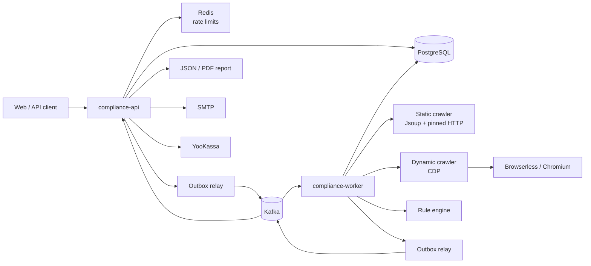
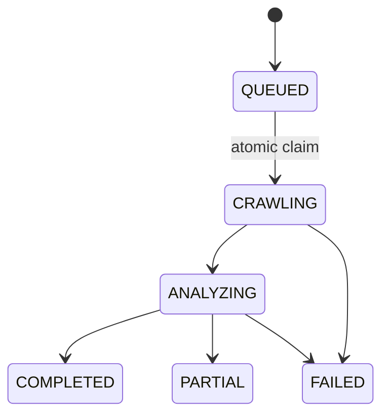

# okdocs Compliance Scanner

Платформа для автоматизированного технического аудита сайтов на соответствие требованиям
privacy, защиты персональных данных и веб-безопасности. Система обходит сайт, собирает
воспроизводимые технические сигналы, применяет правила выбранной юрисдикции и формирует отчёт
с оценкой риска, доказательствами и рекомендациями по исправлению.

Проект ориентирован на реальную эксплуатацию: API и обработчики сканов масштабируются отдельно,
события доставляются через Kafka и transactional outbox, сетевые операции ограничены дедлайнами,
а ошибки возвращаются в виде стабильных машинных кодов.

> Сканер выявляет технические признаки риска и помогает приоритизировать исправления, но не
> заменяет юридическое заключение. Правила и ссылки на законодательство должны проходить
> регулярную проверку профильным специалистом.

## Содержание

- [Какую пользу даёт проект](#какую-пользу-даёт-проект)
- [Основные возможности](#основные-возможности)
- [Режимы сканирования](#режимы-сканирования)
- [Что анализирует сканер](#что-анализирует-сканер)
- [Архитектура](#архитектура)
- [Надёжность обработки](#надёжность-обработки)
- [Crawler и сетевая безопасность](#crawler-и-сетевая-безопасность)
- [Юрисдикции и движок правил](#юрисдикции-и-движок-правил)
- [Технологический стек](#технологический-стек)
- [Быстрый старт](#быстрый-старт)
- [Конфигурация](#конфигурация)
- [API](#api)
- [Тестирование](#тестирование)
- [Эксплуатация](#эксплуатация)
- [Документация](#документация)

## Какую пользу даёт проект

| Для кого | Практический результат |
|---|---|
| Владелец сайта | Быстрый первичный аудит без ручного просмотра каждой страницы и понятный список приоритетных исправлений. |
| Команда разработки | Повторяемая техническая проверка перед релизом: URL, доказательство, severity и рекомендация доступны в структурированном отчёте. |
| Веб-студия или агентство | Единый формат проверки разных клиентских сайтов и артефакт, который можно передать заказчику. |
| Compliance- или security-команда | История сканов, повторные проверки и мониторинг позволяют видеть регрессии после изменений сайта. |
| Служба эксплуатации | Машинные причины `FAILED`, метрики и `incidentId` отделяют недоступность сайта от дефекта инфраструктуры сканера. |

Вместо бинарного ответа «соответствует / не соответствует» система сохраняет наблюдаемые факты:
какая страница проверялась, какой сигнал найден, насколько он достоверен и какое правило его
интерпретировало. Это делает результат пригодным и для пользователя, и для последующей
автоматизации.

## Основные возможности

- параллельный статический обход сайта на Jsoup;
- динамический проход через удалённый Chromium по Chrome DevTools Protocol;
- анализ HTML-форм, cookie, localStorage, трекеров и consent-сценариев;
- проверка TLS, HTTPS, security headers, DNS и географии инфраструктуры;
- отдельные rule packs для `RU`, `EU`, `UK`, `DE`, `FR` и `ES`;
- отчёты `FREE` и `PREMIUM`, сохранённые как согласованные JSON-снапшоты;
- PDF-отчёт, история сканов и заявки на устранение нарушений;
- периодический мониторинг сайтов для платных планов;
- guest JWT, пользовательская аутентификация, OAuth2 и refresh-token families;
- баланс сканов, тарифы, оплата через YooKassa и идемпотентный refund при неуспешном premium-скане;
- надёжная событийная обработка через Kafka и transactional outbox;
- rate limiting через Redis и Bucket4j;
- Actuator health checks, Micrometer-метрики и Prometheus endpoint;
- durable email outbox для системных и отчётных писем.

## Режимы сканирования

| Режим | Запуск | Объём | Рендеринг | Биллинг и хранение |
|---|---|---|---|---|
| `FREE_MARKETING` | `POST /api/free-scans` | Главная страница, лимит 1 | Только static | Без списания; короткий retention |
| `CABINET_PREMIUM` | `POST /api/cabinet/scans` | Полный обход, по умолчанию до 100 страниц | Static + обязательный dynamic CDP | Списание 1 кредита; refund при `FAILED`; история в кабинете |
| Monitoring run | Планировщик или `run-now` | Premium pipeline | Static + dynamic CDP | Учитывает тариф, лимит мониторов и баланс |

Бесплатная проверка всегда анализирует корень сайта. Если пользователь передаст
`https://icr.su/rus/contacts/accounts.php`, API провалидирует исходный адрес, но сохранит целью
`https://icr.su`. Это не позволяет случайной внутренней странице подменить обещанную проверку
главной страницы.

Premium-скан не маскирует отсутствие браузерного анализа результатом static-only. Если обязательный
CDP недоступен, скан завершается как `FAILED`, а списанный кредит возвращается.

## Что анализирует сканер

### Privacy и персональные данные

- наличие и доступность политики конфиденциальности;
- формы сбора данных, их transport security и `action`;
- consent checkbox и предустановленное согласие;
- наличие контактов оператора;
- признаки трансграничной передачи и иностранных auth-провайдеров;
- полнота privacy notice и прав субъектов данных для GDPR-профилей.

### Cookie и tracking

- сторонние tracker-домены;
- cookie и localStorage до получения согласия;
- появление баннера и сетевые запросы до consent;
- сценарии `Reject` и `Accept`;
- наличие понятного отказа и эффективность выбора пользователя;
- флаги `Secure` и `HttpOnly` у чувствительных cookie.

### Transport и web security

- принудительный HTTPS и mixed content;
- валидность, hostname и срок действия TLS-сертификата;
- устаревшие TLS-протоколы;
- HSTS, CSP, Referrer-Policy, X-Content-Type-Options и frame protection;
- wildcard CORS и кеширование чувствительных страниц;
- раскрытие технологического стека в заголовках.

### DNS и инфраструктура

- страна размещения и multi-country hosting;
- иностранные web- и mail-провайдеры;
- CNAME на внешние облачные сервисы;
- ошибки DNS как отдельный наблюдаемый результат.

Finding хранит не только код и severity, но также статус верификации. Неполный или недоступный
источник данных не должен превращаться в подтверждённое нарушение: такие проверки попадают в
`unverifiedRules` и не уменьшают score как `CONFIRMED`.

## Архитектура

Production-топология разделяет синхронный API и ресурсоёмкий worker. Для локальной разработки
`compliance-app` запускает оба компонента в одном JVM.



### Модули

| Модуль | Ответственность |
|---|---|
| `compliance-contracts` | DTO, enum, Kafka events, модели crawler и стабильные wire-контракты; без Spring/JPA. |
| `compliance-persistence` | JPA-модель, репозитории, optimistic locking и Flyway-миграции PostgreSQL. |
| `compliance-messaging` | Общий transactional outbox relay для API и worker. |
| `compliance-mail` | Durable email outbox, Handlebars-шаблоны и SMTP transport. |
| `compliance-rules` | Изолированный от инфраструктуры rule engine и наборы правил по юрисдикциям. |
| `compliance-api` | REST API, JWT/OAuth2, rate limiting, кабинет, платежи, мониторинг и выдача отчётов. |
| `compliance-worker` | Kafka consumer, static/dynamic crawling, enrichment, правила, score и сборка отчёта. |
| `compliance-app` | Локальный combined launcher: API и worker в одном процессе. |

Зависимости направлены от runtime-модулей к контрактам и инфраструктурным адаптерам. Rule engine
не зависит от Spring, JPA или Kafka, поэтому правила можно тестировать как обычные Java-классы.

### Жизненный цикл скана



- `COMPLETED` — целевой объём обработан;
- `PARTIAL` — отчёт сформирован, но часть страниц или enrichment-шагов недоступна;
- `FAILED` — анализировать нечего либо общий pipeline не завершился;
- любой терминальный статус необратим.

### Поток обработки

1. API валидирует URL, principal, юрисдикцию, rate limit и доступный баланс.
2. Строка скана и `ScanRequestedEvent` записываются в PostgreSQL одной транзакцией.
3. Outbox relay публикует команду в Kafka.
4. Worker атомарно захватывает скан переходом `QUEUED → CRAWLING`.
5. Static crawler обходит сайт; premium-поток дополнительно запускает dynamic CDP.
6. Enrichment дополняет страницы DNS, GeoIP, TLS и другими техническими сигналами.
7. Rule engine выполняет только слои выбранной юрисдикции.
8. Worker сохраняет findings, score, diagnostics и free/premium report snapshots.
9. Терминальный статус и событие `ScanCompletedEvent` или `ScanFailedEvent` фиксируются через outbox.
10. API обновляет мониторинг, отправляет уведомления и делает refund, когда он требуется.

## Надёжность обработки

### Transactional outbox

Изменение состояния и исходящее событие записываются в одной DB-транзакции. Relay забирает события
короткими batch-транзакциями с `FOR UPDATE SKIP LOCKED`, публикует их в Kafka вне транзакции и
использует exponential backoff. После исчерпания попыток событие получает статус `DEAD` и становится
видимым в метриках.

Kafka имеет семантику at-least-once, поэтому повторная доставка ожидаема. Право выполнения скана
выдаёт атомарный `QUEUED → CRAWLING` claim: сообщения для уже работающего или терминального скана
подтверждаются без повторного запуска crawler.

### Дедлайны и reaper

Сетевой pipeline ограничен на нескольких уровнях. Актуальные значения по умолчанию:

| Граница | Настройка | Значение |
|---|---|---|
| TCP connect | `compliance.crawler.connect-timeout-ms` | `4000 ms` |
| TLS handshake | `compliance.crawler.tls-handshake-timeout-ms` | `10000 ms` |
| Страница / response read | `compliance.crawler.page-timeout-ms` | `15000 ms` |
| Static crawl | `compliance.crawler.crawler-timeout-seconds` | `90 s` |
| Весь scan pipeline | `compliance.scan.total-deadline` | `5 min` |
| Stuck scan reaper | `compliance.scan.stale-after` | `7 min` |

Пул static workers принудительно останавливается по общему дедлайну. Reaper завершает потерявший
владельца скан как `PIPELINE_TIMEOUT`, но не перезаписывает уже сохранённую первичную причину.
Критичные соотношения таймаутов валидируются при старте приложения.

### Детальные причины `FAILED`

API и `ScanFailedEvent` возвращают структурированную причину без текста исключения и имени
Java-класса:

```json
{
  "status": "FAILED",
  "errorMessage": "Сайт не завершил защищённое соединение вовремя",
  "failure": {
    "code": "TLS_HANDSHAKE_TIMEOUT",
    "stage": "TLS",
    "retryable": true,
    "httpStatus": null,
    "fetchMode": "HTTP",
    "fallbackAttempted": false,
    "incidentId": null
  }
}
```

Коды различают validation, DNS, connect, TLS, HTTP, browser, parsing, analysis и pipeline errors.
`retryable` описывает характер причины, но сам по себе не запускает бесконечный retry. Неожиданная
внутренняя ошибка получает `incidentId`, по которому можно связать ответ пользователя с логами.
Полный контракт и политика классификации описаны в
[`FAILED-REASONS.md`](FAILED-REASONS.md).

### Региональная доступность

Скан отражает доступность сайта из сети, где запущен worker. Например,
`TLS_HANDSHAKE_TIMEOUT` с российской точки означает, что защищённое соединение не было завершено
вовремя; одного такого наблюдения недостаточно, чтобы автоматически утверждать геоблокировку.

Зарубежный proxy fallback сейчас не включён в pipeline. Для корректного определения регионального
ограничения нужны как минимум две явно обозначенные точки проверки, а отчёт должен сохранять
исходный и fallback-регионы. Иначе зарубежная доступность может быть ошибочно выдана за доступность
для пользователей из РФ.

## Crawler и сетевая безопасность

### Static crawler

`SiteCrawler` — параллельный BFS crawler на Jsoup. Источники URL:

- главная страница;
- sitemap;
- приоритетные пути: privacy, contacts, terms и формы;
- внутренние ссылки найденных страниц.

Crawler учитывает `robots.txt`, глубину и лимит страниц, ограничивает response body, поддерживает
редиректы до 8 переходов и регулирует нагрузку на сайт через concurrency и задержку между
запросами.

Слоты параллельного обхода разделены на `reserved` и `accepted`: медленный или ошибочный запрос
не уменьшает фактический лимит успешно принятых страниц.

### Pinned HTTP fetcher и SSRF

`PinnedHttpFetcher` повторно валидирует DNS непосредственно перед сетевым запросом, подключается
к разрешённому IP и сохраняет исходный hostname для HTTP `Host`, TLS SNI и hostname verification.
Такая схема уменьшает риск DNS rebinding между API-валидацией и worker fetch.

Проверка выполняется перед каждым fetch и redirect hop. Блокируются loopback, private,
link-local, multicast, reserved ranges, IPv6 ULA, IPv4-mapped IPv6, cloud metadata и домены из
общей anti-abuse политики. Аналогичный request filter действует внутри Chromium.

### Dynamic crawler

`CdpDynamicCrawler` работает через HTTP/WebSocket CDP напрямую; Node.js и Playwright worker-у не
нужны. Он собирает DOM, cookies, localStorage и сетевой timeline, а также выполняет
consent-сценарии `before → Reject → Accept`.

При включённом premium-потоке worker проверяет Browserless во время старта. Некорректный
`base-url`, отсутствующий token или недоступный `/json/version` останавливают приложение раньше,
чем платный скан попадёт в неработающий pipeline.

## Юрисдикции и движок правил

Юрисдикция — это выбранный правовой профиль, а не страна хостинга сайта.

| Код | Активные слои | Назначение |
|---|---|---|
| `RU` | `RU` | Технические проверки и эвристики для российского privacy-контекста и 152-ФЗ. |
| `EU` | `EU` | GDPR/ePrivacy baseline и consent-сценарии. |
| `UK` | `UK` | Отдельный UK GDPR/PECR profile; EU baseline не наследуется. |
| `DE` | `EU + DE` | EU baseline с overlay требований TDDDG. |
| `FR` | `EU + FR` | EU baseline с overlay практики CNIL. |
| `ES` | `EU + ES` | EU baseline с overlay практики AEPD. |

Общие детекторы TLS, headers, cookie и tracking используются повторно, но получают локализованные
метаданные и правовое обоснование выбранного слоя. Национальный overlay имеет приоритет над
baseline-метаданными.

Score рассчитывается как `100 − Σ(basePoints × verificationWeight)`. По умолчанию:

- `CONFIRMED` влияет с весом `1.0`;
- `DETECTED` — с весом `0.65`;
- `UNVERIFIED`, `FALSE_POSITIVE` и отсутствие результата — с весом `0`.

Так недоступность внешнего источника не превращается в штраф пользователю.

## Технологический стек

- Java 21;
- Spring Boot 3.5, Spring Security, Spring Data JPA и Actuator;
- Maven multi-module build;
- PostgreSQL 16 и Flyway;
- Apache Kafka;
- Redis, Bucket4j и Lettuce;
- Jsoup;
- Browserless / Chromium и собственный Java CDP client;
- GeoIP2 / DB-IP;
- Apache PDFBox;
- Handlebars и Spring Mail;
- Micrometer и Prometheus;
- JUnit 5, Mockito, Spring Kafka Test и Testcontainers.

## Быстрый старт

### Требования

- JDK 21;
- Maven 3.9+;
- Docker с Compose plugin;
- `curl` для проверки API;
- `jq` только для приведённого ниже shell-примера.

### 1. Запустить инфраструктуру

`docker-compose.override.yml` подхватывается автоматически и добавляет локальные PostgreSQL,
Kafka, Kafka UI и порты к базовым Redis и Browserless.

```bash
export CDP_AUTH_TOKEN=local-cdp-token
docker compose up -d
docker compose ps
```

Локальные адреса:

| Сервис | Адрес |
|---|---|
| API | `http://localhost:8080` |
| Kafka UI | `http://localhost:8081` |
| PostgreSQL | `localhost:5432` |
| Kafka | `localhost:9092` |
| Redis | `localhost:6379` |
| Browserless | `http://localhost:3005` |

### 2. Собрать проект

Установка модулей в локальный Maven repository нужна, чтобы отдельный launcher мог разрешить
внутренние зависимости:

```bash
mvn -B -ntp -DskipTests install
```

### 3. Запустить combined application

`compliance-app` использует профиль `local` по умолчанию. В нём premium CDP выключен, поэтому
разработка бесплатного static flow не зависит от Browserless.

```bash
mvn spring-boot:run -pl compliance-app
```

### 4. Запустить бесплатный скан

```bash
TOKEN=$(
  curl -sS -X POST http://localhost:8080/api/auth/guest |
    jq -r '.accessToken'
)

curl -sS -X POST http://localhost:8080/api/free-scans \
  -H "Authorization: Bearer $TOKEN" \
  -H "Content-Type: application/json" \
  -d '{"siteUrl":"https://example.com/path","jurisdiction":"RU","locale":"ru"}'
```

Ответ имеет статус `202 Accepted`. Дальше клиент опрашивает:

```bash
curl -sS http://localhost:8080/api/compliance-scans/<scan-id> \
  -H "Authorization: Bearer $TOKEN"
```

Тот же guest token обязателен для чтения результата: scan resources проверяют владельца на
сервере и не являются публичными.

### Раздельный запуск API и worker

```bash
mvn spring-boot:run -pl compliance-api
mvn spring-boot:run -pl compliance-worker -Dspring-boot.run.profiles=local
```

Раздельный режим ближе к production-топологии. Общие worker-настройки импортируются из
`application-compliance-core.yml`, чтобы standalone worker и combined app не расходились по
таймаутам, score и лимитам.

## Конфигурация

Основные инфраструктурные переменные:

| Переменная | Назначение |
|---|---|
| `DB_URL`, `DB_USERNAME`, `DB_PASSWORD` | PostgreSQL |
| `KAFKA_BOOTSTRAP_SERVERS` | Kafka brokers |
| `KAFKA_SECURITY_PROTOCOL`, `KAFKA_SASL_*` | SASL/SCRAM и TLS для production Kafka |
| `REDIS_HOST`, `REDIS_PORT`, `REDIS_PASSWORD` | Distributed rate limiting |
| `JWT_SECRET` | Подпись guest/user JWT; production secret должен быть не короче 256 бит |
| `CDP_ENABLED`, `CDP_BASE_URL`, `CDP_AUTH_TOKEN` | Browserless/CDP |
| `CDP_PREMIUM_ENABLED` | Fail-fast контракт доступности premium dynamic flow |
| `GEOIP_DB_PATH` | GeoIP database |
| `SMTP_*`, `MAIL_*` | Email transport и durable mail outbox |
| `OAUTH_*` | OAuth providers и redirect flow |
| `YOOKASSA_*`, `PAYMENT_WEBHOOK_SECRET` | Платежи и webhook |

Все прикладные настройки используют префикс `compliance.*`. Основные группы:

- `compliance.crawler.*` — лимиты, concurrency, robots, body size и сетевые таймауты;
- `compliance.crawler.dynamic.*` — CDP, batch limits и consent-сценарии;
- `compliance.scan.*` — дедлайны, retention и доступные юрисдикции;
- `compliance.score.*` — severity points и verification weights;
- `compliance.outbox.*` — batch, retries и backoff;
- `compliance.plan.*` и `compliance.monitoring.*` — квоты и мониторинг;
- `compliance.security.*` — forwarded headers и domain policy.

Production secrets, `.env`, truststore и сертификаты нельзя коммитить в репозиторий.

## API

Основные группы endpoint:

| Область | Endpoint |
|---|---|
| Guest и user auth | `/api/auth/**` |
| Бесплатный скан | `POST /api/free-scans` |
| Premium-скан | `POST /api/cabinet/scans` |
| Статус, история, JSON/PDF отчёт | `/api/compliance-scans/**` |
| Каталог юрисдикций | `/api/jurisdictions/**` |
| Кабинет и баланс | `/api/cabinet/**` |
| Мониторинг сайтов | `/api/cabinet/monitors/**` |
| Каталог тарифов | `/api/pricing/plans/**` |
| Платежи | `/api/payments/**` |
| Admin API | `/api/admin/**` |

Защищённые запросы используют `Authorization: Bearer <token>`. Доступ к скану проверяется по
`userId` или `guestId`, поэтому знание UUID не даёт доступ к чужому отчёту.

Полный контракт, DTO и коды ответов: [`compliance-api/API.md`](compliance-api/API.md).

## Тестирование

Быстрая проверка модулей:

```bash
mvn test
```

Полная проверка, используемая перед деплоем:

```bash
mvn -B -ntp verify
```

`verify` включает unit tests и integration tests через Failsafe/Testcontainers, поэтому требуется
работающий Docker.

Точечные примеры:

```bash
mvn -pl compliance-api -am test
mvn -pl compliance-worker -am test
mvn -pl compliance-worker -am \
  -Dtest=SiteCrawlerTest \
  -Dsurefire.failIfNoSpecifiedTests=false \
  test
```

## Эксплуатация

### Production deployment

В production запускаются два отдельных контейнера:

- `compliance-api` обслуживает HTTP, auth, кабинет, платежи и чтение отчётов;
- `compliance-worker` потребляет Kafka и выполняет crawling/analysis.

PostgreSQL и Kafka ожидаются как внешняя инфраструктура. Redis и Browserless запускаются на
application host:

```bash
docker compose \
  -f docker-compose.yml \
  -f docker-compose.prod.yml \
  -f docker-compose.deploy.yml \
  up -d
```

GitHub Actions собирает отдельные OCI images для API и worker, публикует immutable
`sha-<commit>` tags в GHCR и поддерживает селективный деплой по изменённым модулям.

### Observability

Доступны:

```text
/actuator/health
/actuator/info
/actuator/metrics
/actuator/prometheus
```

Ключевые метрики:

- pending/dead outbox events;
- scan outcome и duration по status, kind и jurisdiction;
- static/dynamic crawler success и failure;
- rule evaluation errors;
- listener failures и stuck-scan reaper;
- длительность отдельных pipeline phases.

Логи worker содержат MDC-поля `scanId`, `scanKind` и, для внутренних ошибок, `incidentId`.

### Горизонтальное масштабирование

- Kafka consumer group распределяет партиции между worker replicas;
- atomic scan claim предотвращает повторную обработку;
- outbox publishers делят batch через `SKIP LOCKED`;
- optimistic locking защищает lifecycle и баланс;
- API rate limits хранятся в Redis;
- лимиты crawler и CDP задаются на реплику.

Количество Kafka partitions, listener concurrency, DB pool и Browserless concurrency следует
масштабировать согласованно.

## Документация

| Документ | Содержание |
|---|---|
| [`compliance-api/API.md`](compliance-api/API.md) | Полный REST API и DTO |
| [`FAILED-REASONS.md`](FAILED-REASONS.md) | Контракт структурированных причин `FAILED` |
| [`docs/RUNBOOK-worker.md`](docs/RUNBOOK-worker.md) | Диагностика worker, outbox, reaper и CDP |
| [`docs/CI-CD.md`](docs/CI-CD.md) | GitHub Actions, GHCR, deployment и rollback |
| [`compliance-api/RU_REPORT_V2_METHODOLOGY.md`](compliance-api/RU_REPORT_V2_METHODOLOGY.md) | Методика RU report v2 |
| [`docs/PLAN-jurisdictions.md`](docs/PLAN-jurisdictions.md) | Модель jurisdiction layers и overlays |
| [`docs/PLAN.md`](docs/PLAN.md) | Расширенный инженерный план и принятые решения |

## Правила разработки

- Wire-контракты и общие enum размещаются в `compliance-contracts`.
- Правила не должны зависеть от Spring, JPA, Kafka или HTTP-клиентов.
- Изменение состояния и отправка доменного события выполняются через transactional outbox.
- Решения о режиме выполнения берутся из строки скана в БД, а не из недоверенного Kafka payload.
- Новая сетевая операция обязана иметь timeout/deadline и проходить SSRF-проверку.
- Новые failure codes должны быть стабильными, user-safe и backward-compatible для старых клиентов.
- `compliance-app` используется для локальной разработки; production разворачивает API и worker отдельно.
