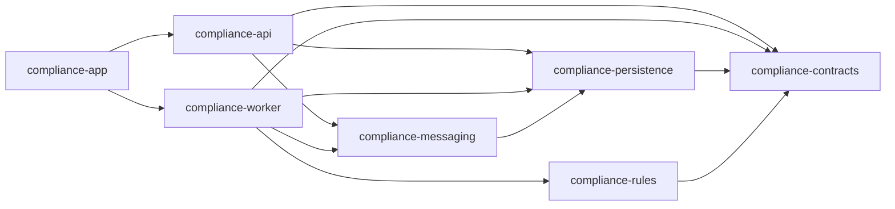

# okdocs Compliance Scanner

okdocs Compliance Scanner is a Java/Spring service for automated website checks against
privacy and personal data compliance requirements across supported jurisdictions. It crawls
a site, extracts forms, scripts, links and hosting signals, evaluates them with a
jurisdiction-aware rule engine, and produces a report with risk score, findings, evidence
and remediation guidance.

The current implementation targets a product flow with two scan modes:

- **Free marketing scan**: one-page, static-only scan for anonymous or authenticated users.
- **Cabinet premium scan**: full crawl with static and dynamic rendering, available to registered users and charged against the scan balance.

## Table of Contents

- [Capabilities](#capabilities)
- [Compliance Scope](#compliance-scope)
- [Architecture](#architecture)
- [Modules](#modules)
- [Request Flow](#request-flow)
- [Crawler and Rules](#crawler-and-rules)
- [Technology Stack](#technology-stack)
- [Repository Layout](#repository-layout)
- [Prerequisites](#prerequisites)
- [Local Development](#local-development)
- [Configuration](#configuration)
- [API Overview](#api-overview)
- [Testing](#testing)
- [Operations](#operations)
- [Security Notes](#security-notes)

## Capabilities

The scanner currently covers the core technical signals needed for website privacy audits:

- static HTML crawling with sitemap and high-priority path seeding
- parallel static crawling with strict page-limit semantics
- optional dynamic rendering through a remote Chromium CDP endpoint
- form extraction and consent checkbox analysis
- tracker and pre-consent tracker detection
- privacy policy and operator contact checks
- foreign hosting and foreign auth provider signals
- RKN registry lookup result handling
- scoring, severity mapping and report snapshot persistence
- guest and user JWT authentication
- scan balance, monthly plan quota and refund-on-failure flow
- transactional outbox for Kafka event publication
- admin endpoints for users, balances and audit log access
- Actuator health, metrics and Prometheus endpoints

## Compliance Scope

The data model and rule engine are jurisdiction-aware. A scan carries `ScanJurisdiction`
(`RU`, `EU`, `GM`), and rules are executed only when their `RuleDefinition.jurisdiction`
matches the scan jurisdiction.

Current implementation status:

| Jurisdiction | Status | Notes |
|---|---|---|
| `RU` | Implemented | Production rules currently target Russian 152-FZ checks and related administrative liability references. |
| `EU` | Architecture-ready | The contract and rule engine support EU/GDPR rule isolation; concrete GDPR/ePrivacy rules are planned as a separate rule package. |
| `GM` | Contract value reserved | Present in contracts for future generic/global checks. |

European privacy standards that the EU-oriented rule set can cover:

| Scope | Standard or law | Typical website audit coverage |
|---|---|---|
| European Union | GDPR, Regulation (EU) 2016/679 | Lawful basis, transparency, privacy notices, data subject rights, processor/controller disclosures, international transfers. |
| European Union | ePrivacy Directive 2002/58/EC, as amended by 2009/136/EC | Cookies, tracking technologies, consent before non-essential storage/access on user devices. |
| European Union | EDPB Guidelines | Consent validity, transparency, controller/processor roles, international transfer interpretation. |
| European Union | Standard Contractual Clauses and transfer impact assessment practice | Cross-border transfer risk, third-country recipients, external processors and trackers. |
| Germany | BDSG and TTDSG/TDDDG | GDPR supplements, employee data specifics, cookie and terminal-equipment access rules. |
| France | Loi Informatique et Libertés and CNIL cookie guidelines | Privacy notice quality, consent banners, tracker activation before consent. |
| Spain | LOPDGDD and LSSI-CE | GDPR supplements, cookie consent and information society service disclosures. |
| Italy | Codice Privacy and Garante cookie guidelines | GDPR supplements, cookie consent, tracker and profiling transparency. |
| Netherlands | UAVG and Telecommunicatiewet | GDPR implementation, cookie and tracking consent requirements. |
| Poland | Personal Data Protection Act and UODO guidance | GDPR implementation, privacy notice and processing transparency expectations. |
| Ireland | Data Protection Act 2018 and DPC guidance | GDPR implementation, cookie/tracker compliance, controller transparency. |
| Belgium | Data Protection Act and APD/GBA guidance | GDPR implementation, cookie and transparency expectations. |
| Austria | DSG and TKG/TTKG-style telecommunications privacy rules | GDPR supplements and cookie/terminal-equipment access requirements. |
| Portugal | Law 58/2019 and CNPD guidance | GDPR implementation, transparency and consent requirements. |
| Nordics and Baltics | National GDPR implementation acts and DPA guidance | GDPR supplements, transparency, cookies and tracking enforcement practice. |
| Switzerland | Federal Act on Data Protection, revised FADP | European non-EU privacy framework; transparency, processor, transfer and security obligations. |
| United Kingdom | UK GDPR, Data Protection Act 2018 and PECR | European-region non-EU framework; privacy notices, cookies, trackers and direct marketing rules. |

This repository is an engineering implementation, not legal advice. Rule metadata and legal
references should be reviewed before being used as a final compliance opinion in any jurisdiction.

## Architecture

The project is a Maven multi-module Spring Boot application. The production topology separates
API and worker processes. For local development, `compliance-app` combines both into one process.

```text
compliance-app
  local combined launcher: API + worker in one JVM

compliance-api
  REST API, authentication, rate limiting, scan creation, cabinet/admin endpoints

compliance-worker
  Kafka consumer, crawler, dynamic renderer integration, rule execution, report assembly

compliance-contracts
  DTOs, enums, Kafka events and crawler model records

compliance-persistence
  JPA entities, repositories and Flyway migrations

compliance-messaging
  transactional outbox relay shared by API and worker

compliance-rules
  compliance rule engine and rule implementations
```

High-level dependencies:



## Modules

| Module | Purpose |
|---|---|
| `compliance-contracts` | Public DTOs, enums, Kafka events, crawler records. No Spring or JPA dependency. |
| `compliance-persistence` | Database model, Spring Data repositories, Flyway migrations. |
| `compliance-messaging` | Transactional outbox publisher used by both API and worker. |
| `compliance-rules` | Rule engine and compliance rule implementations. |
| `compliance-api` | REST API, JWT auth, rate limiting, scan commands, cabinet and admin endpoints. |
| `compliance-worker` | Kafka worker, static crawler, CDP dynamic crawler, enrichment, scoring and report snapshots. |
| `compliance-app` | Local combined runtime that imports API and worker as libraries. |

## Request Flow

1. The client obtains a guest token through `POST /api/auth/guest` or logs in as a user.
2. The API creates a `compliance_scans` row and writes `ScanRequestedEvent` to the outbox in the same transaction.
3. `OutboxPublisher` publishes the event to Kafka.
4. The worker consumes `ScanRequestedEvent`, loads the scan row from PostgreSQL and determines execution mode from the database.
5. The worker runs static crawling and, for premium scans when required, dynamic CDP rendering.
6. Extracted page data is evaluated by the rule engine.
7. The worker assembles findings, score, diagnostics and report snapshot.
8. The scan is completed as `COMPLETED`, `PARTIAL` or `FAILED`.
9. Completion or failure events are written through the same transactional outbox pattern.
10. The API exposes status and report data through `/api/compliance-scans/{id}` and `/api/compliance-scans/{id}/report`.

## Crawler and Rules

### Static Crawler

`SiteCrawler` is a parallel Jsoup-based BFS crawler. It uses:

- sitemap discovery
- priority path seeding for privacy, contacts, terms and similar pages
- internal-link BFS from the homepage
- robots.txt support, configurable through `compliance.crawler.respect-robots`
- redirect validation with a maximum of 8 hops
- SSRF host validation before every fetch, including robots.txt, sitemap and redirect hops
- response body size limits
- per-page, connect and total crawl timeouts
- configurable static fetch concurrency

The parallel page limit is intentionally split into two counters:

- `reserved`: temporary slots held by in-flight fetches and accepted pages
- `accepted`: monotonic count of pages that were actually accepted into the result set

This avoids premature crawl termination when slow failing pages temporarily occupy all slots. If a slot is unavailable but the accepted page limit has not been reached, the URL is requeued and retried later.

### Dynamic Crawler

Dynamic rendering is implemented in `CdpDynamicCrawler` over `java.net.http.WebSocket` and a remote Chromium CDP endpoint, for example Browserless. Playwright and Node.js are not required.

Dynamic mode is gated by scan execution kind:

- `FREE_MARKETING`: static-only
- `CABINET_PREMIUM`: static plus dynamic when `dynamicRequired=true`

Premium scans do not silently degrade to static when CDP is required and unavailable. In that case the scan fails and the balance credit is refunded.

### Rule Engine

Rules live in `compliance-rules` and emit rule facts. Worker-side assembly maps facts to persisted findings, applies metadata, calculates severity impact and stores report snapshots. The rule engine is jurisdiction-aware; the concrete rule list below describes the current RU implementation.

Currently implemented RU rule areas include:

- missing privacy policy
- unprotected data forms
- default-checked consent
- missing cookie consent
- third-party trackers
- trackers before consent
- foreign auth providers
- cross-border transfer signals
- missing operator contacts
- non-Russian hosting
- RKN registry lookup status

## Technology Stack

- Java 21
- Spring Boot 3.5
- Maven multi-module build
- PostgreSQL and Flyway
- Spring Data JPA
- Kafka
- Transactional outbox
- Redis and Bucket4j for API rate limiting outside the local profile
- Jsoup for static crawling
- Java HTTP/WebSocket CDP client for dynamic crawling
- GeoIP2 / DB-IP country database
- Micrometer and Prometheus
- JUnit 5, Mockito, Spring Kafka Test and Testcontainers

## Repository Layout

```text
.
├── compliance-api
├── compliance-app
├── compliance-contracts
├── compliance-messaging
├── compliance-persistence
├── compliance-rules
├── compliance-worker
├── docker-compose.yml
├── docker-compose.override.yml
├── docker-compose.prod.yml
├── docker-compose.infra.prod.yml
├── PLAN.md
├── PROJECT.md
└── pom.xml
```

## Prerequisites

- JDK 21
- Maven 3.9+
- Docker, for Testcontainers and optional local services
- PostgreSQL 16-compatible database for running the application
- Kafka broker for scan request/result events
- Optional: Redis for non-local rate limiting
- Optional: Browserless or another remote Chromium CDP endpoint for premium dynamic scans
- Optional: `jq` for the shell examples below

## Local Development

### 1. Build the project

```bash
mvn clean test
```

### 2. Start runtime helper services

The provided base Docker Compose files currently start Redis and Browserless. They do not start a local PostgreSQL or Kafka broker.

```bash
export CDP_AUTH_TOKEN=local-cdp-token
docker compose up -d redis browserless
```

For the application itself, provide PostgreSQL and Kafka through one of these options:

- run local PostgreSQL and Kafka yourself at the defaults used by the app
- point `DB_URL` and `KAFKA_BOOTSTRAP_SERVERS` to a shared development environment
- use Testcontainers-backed integration tests when you only need verification rather than an interactive local app

Default application values:

```text
DB_URL=jdbc:postgresql://localhost:5432/compliance
DB_USERNAME=compliance
DB_PASSWORD=compliance
KAFKA_BOOTSTRAP_SERVERS=localhost:9092
```

### 3. Run the combined local application

`compliance-app` starts API and worker in one JVM and uses the `local` profile by default.

```bash
mvn spring-boot:run -pl compliance-app
```

The API listens on:

```text
http://localhost:8080
```

The local profile disables premium CDP fail-fast by setting:

```yaml
compliance:
  crawler:
    dynamic:
      premium-enabled: false
```

This lets the combined app start without a working Browserless endpoint. Free static scans can still run.

### 4. Run API and worker separately

For a production-like local process split:

```bash
mvn spring-boot:run -pl compliance-api
mvn spring-boot:run -pl compliance-worker -Dspring-boot.run.profiles=local
```

The standalone worker imports `application-compliance-core.yml`, which contains the shared crawler, scan, score, outbox and dynamic defaults.

## Configuration

All application-specific configuration uses the `compliance.*` prefix.

### API Configuration

| Property | Purpose |
|---|---|
| `compliance.auth.jwt-secret` | Signing secret for guest and user JWTs. Must be replaced in production. |
| `compliance.auth.access-token-ttl` | User access token lifetime. |
| `compliance.auth.refresh-token-ttl` | User refresh token lifetime. |
| `compliance.auth.guest-token-ttl` | Guest token lifetime. |
| `compliance.rate-limit.guest-scans-per-ip-per-hour` | Guest scan rate limit. |
| `compliance.rate-limit.user-scans-per-hour` | Authenticated user scan rate limit. |
| `compliance.scan.free-marketing-max-pages` | Page limit for free marketing scans. |
| `compliance.scan.guest-max-pages` | Legacy guest scan page limit retained in config. |
| `compliance.scan.user-max-pages` | Page limit for cabinet scans. |
| `compliance.plan.quota.*` | Monthly scan credits by plan. |
| `compliance.security.trust-forwarded-header` | Whether `X-Forwarded-For` is trusted for client IP resolution. |

### Worker and Crawler Configuration

| Property | Purpose |
|---|---|
| `compliance.crawler.max-pages` | Global upper bound for pages per static crawl. |
| `compliance.crawler.max-depth` | Maximum BFS crawl depth. |
| `compliance.crawler.connect-timeout-ms` | TCP connect timeout. |
| `compliance.crawler.page-timeout-ms` | Per-page fetch/read timeout. |
| `compliance.crawler.crawler-timeout-seconds` | Total static crawler deadline. |
| `compliance.crawler.concurrency` | Parallel static fetch worker count. |
| `compliance.crawler.rate-limit-ms` | Delay between requests per static fetch worker. |
| `compliance.crawler.max-body-bytes` | Maximum response body size. |
| `compliance.crawler.user-agent` | User-Agent used by static crawler. |
| `compliance.crawler.respect-robots` | Whether robots.txt is honored. |
| `compliance.crawler.allowed-domains` | Optional allowlist for crawled domains. |
| `compliance.crawler.blocked-domains` | Denylist for crawled domains. |
| `compliance.crawler.dynamic.*` | CDP dynamic crawler settings. |
| `compliance.scan.stale-after` | Reaper threshold for stuck scans. |
| `compliance.scan.redeliver-delay` | Kafka redelivery delay when a scan is already being processed. |
| `compliance.scan.total-deadline` | Overall scan deadline beyond crawler timeout. |
| `compliance.score.*` | Score model weights. |
| `compliance.geoip.db-path` | GeoIP database path. |

Cross-field validation fails application startup when critical invariants are broken, for example:

- `scan.stale-after` must be greater than `crawler.crawler-timeout-seconds`
- `scan.total-deadline` must be greater than or equal to `crawler.crawler-timeout-seconds`
- `crawler.dynamic.max-pages` must not exceed `crawler.max-pages`
- premium dynamic mode requires an enabled and configured CDP endpoint unless `premium-enabled=false`

### Kafka Topics

Default topics:

```text
compliance.scan.requested
compliance.scan.completed
compliance.scan.failed
```

Create them before running with Kafka auto-topic creation disabled.

## API Overview

All scan resources are owner-scoped. A scan can be read only by the user who owns it or by the guest principal that created it.

### Authentication

| Method | Path | Access | Description |
|---|---|---|---|
| `POST` | `/api/auth/guest` | Public | Issue a guest JWT. |
| `POST` | `/api/auth/register` | Public | Register a user and return tokens. |
| `POST` | `/api/auth/login` | Public | Authenticate a user. |
| `POST` | `/api/auth/refresh` | Public | Refresh an access token. |
| `POST` | `/api/auth/logout` | Public | Revoke a refresh token. |
| `GET` | `/api/auth/me` | Public | Describe the current principal or anonymous state. |

### Scans

| Method | Path | Access | Description |
|---|---|---|---|
| `POST` | `/api/free-scans` | Guest or user token | Start a free static marketing scan. |
| `POST` | `/api/cabinet/scans` | User token | Start a premium cabinet scan and debit one scan credit. |
| `GET` | `/api/compliance-scans` | User token | List user scans with optional domain/status filters. |
| `GET` | `/api/compliance-scans/{id}` | Owner token | Get scan status and progress. |
| `GET` | `/api/compliance-scans/{id}/report` | Owner token | Get the report snapshot. |
| `POST` | `/api/compliance-scans/{id}/email` | Owner token | Store report email and consent flags. |

### Cabinet

| Method | Path | Access | Description |
|---|---|---|---|
| `GET` | `/api/cabinet` | User token | User dashboard. |
| `GET` | `/api/cabinet/balance` | User token | Current scan balance. |
| `GET` | `/api/cabinet/balance/transactions` | User token | Balance ledger. |
| `POST` | `/api/cabinet/password` | User token | Change password. |

### Admin

| Method | Path | Access | Description |
|---|---|---|---|
| `GET` | `/api/admin/users` | Admin token | Search users. |
| `GET` | `/api/admin/users/{id}` | Admin token | Read a user. |
| `GET` | `/api/admin/users/{id}/scans` | Admin token | Read a user's scans. |
| `POST` | `/api/admin/users/{id}/balance` | Admin token | Adjust balance. |
| `POST` | `/api/admin/users/{id}/plan` | Admin token | Change plan. |
| `POST` | `/api/admin/users/{id}/block` | Admin token | Block a user. |
| `GET` | `/api/admin/stats` | Admin token | Administrative statistics. |
| `GET` | `/api/admin/audit` | Admin token | Audit log. |

### Example: Start a Free Scan

```bash
TOKEN=$(
  curl -s -X POST http://localhost:8080/api/auth/guest \
  | jq -r '.accessToken'
)

curl -i -X POST http://localhost:8080/api/free-scans \
  -H "Authorization: Bearer $TOKEN" \
  -H "Content-Type: application/json" \
  -d '{"siteUrl":"https://example.com"}'
```

Expected response status:

```text
202 Accepted
```

### Example: Read Scan Status

```bash
curl -s http://localhost:8080/api/compliance-scans/<scan-id> \
  -H "Authorization: Bearer $TOKEN"
```

### Common HTTP Status Codes

| Status | Meaning |
|---|---|
| `200` | Request succeeded. |
| `201` | Resource created, for example user registration. |
| `202` | Scan accepted for asynchronous processing. |
| `204` | Request succeeded with no response body. |
| `400` | Validation error. |
| `401` | Missing or invalid token. |
| `402` | Insufficient scan balance. |
| `403` | Resource belongs to another principal or role is insufficient. |
| `404` | Scan or resource not found. |
| `409` | Report is not ready yet. |
| `429` | Rate limit exceeded. |
| `500` | Unexpected server error. |

## Testing

Run all unit tests:

```bash
mvn test
```

Run module tests:

```bash
mvn -pl compliance-worker test
mvn -pl compliance-api test
```

Run a focused crawler test suite:

```bash
mvn -pl compliance-worker -Dtest=SiteCrawlerTest test
```

Run integration tests that use Testcontainers:

```bash
mvn verify
```

Integration tests require Docker. Unit tests use Surefire. Integration tests use Failsafe and the `*IT` naming convention.

## Operations

### Local Combined App

Use `compliance-app` for local development because it runs API and worker in one JVM.

### Production Runtime

Production is intended to run API and worker as separate services:

- `compliance-api` handles REST traffic, authentication, scan creation and result reads.
- `compliance-worker` consumes scan requests and performs crawling, analysis and report assembly.

`docker-compose.prod.yml` is an override for runtime services on the application host. It expects PostgreSQL and Kafka to be external services.

```bash
docker compose -f docker-compose.yml -f docker-compose.prod.yml up -d
```

`docker-compose.infra.prod.yml` is a separate infrastructure compose for PostgreSQL and Kafka on an infra host:

```bash
docker compose --env-file /path/to/prod-infra.env -f docker-compose.infra.prod.yml up -d
```

Do not commit real production `.env` files, passwords, truststores or certificates.

### Observability

Actuator endpoints are enabled for:

```text
/actuator/health
/actuator/info
/actuator/metrics
/actuator/prometheus
```

The worker uses structured logging with MDC fields such as `scanId` and `scanKind` where available.

Useful operational metrics include:

- outbox pending/dead event counts
- scan duration by status and kind
- crawled/fetched/failed page counters
- dynamic crawler success/failure counters
- rule error counters
- listener failure counters
- stuck-scan reaper failure counters

### Stuck Scan Reaper

The worker includes a scheduled reaper for scans stuck in `CRAWLING` or `ANALYZING`. It uses strict transactional lifecycle transitions and optimistic locking so that a live scan is not failed by a stale reaper decision.

## Security Notes

- The API is stateless and uses JWT for guest and user principals.
- User status is checked on authenticated requests, so blocked/deleted users lose access before token expiry.
- Scan results are not public; owner checks are enforced server-side.
- SSRF protection is applied in both API URL validation and worker fetch-time validation.
- Worker URL validation is repeated close to the network request to reduce DNS rebinding risk.
- `X-Forwarded-For` is ignored unless `compliance.security.trust-forwarded-header=true`.
- Dynamic CDP endpoints must be token-protected.
- Browserless blocklists are disabled intentionally so tracker analysis can observe real network traffic.
- Replace all development secrets before production deployment.
- Keep production env files, Kafka truststores and certificates outside the repository.

## Development Notes

- Prefer adding DTOs and external contracts to `compliance-contracts`.
- Keep rule logic free of Spring, JPA and infrastructure dependencies.
- Use the transactional outbox instead of direct Kafka sends for state-changing workflows.
- Keep scan execution decisions in the database scan row; Kafka events are commands and diagnostics, not the source of execution policy.
- Use `compliance-app` only as a local combined launcher. Production should deploy API and worker separately.
